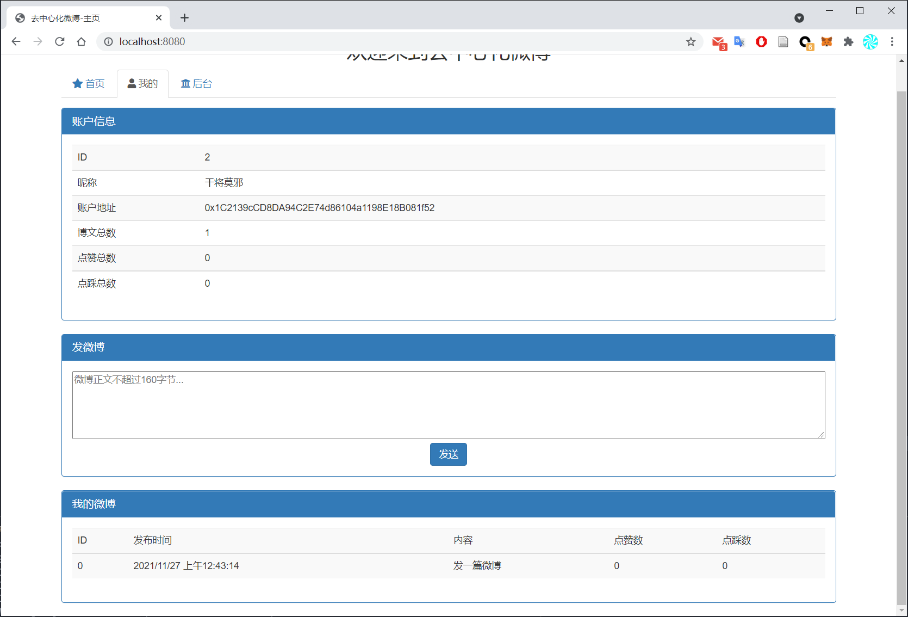

# 区块链课程项目--去中心化微博(dapp-weibo)

这是区块链技术与应用课程项目，基于以太坊智能合约实现一个去中心化的微博。

## 命令
```bash
# Compile:
truffle compile
# Migrate:
truffle migrate
# Test contracts:
truffle test
# Run dev server:       
cd app && npm run dev
# Build for production: 
cd app && npm run build
```

## 效果展示
### 主页根据时间顺序展示了所有微博，用户可以对每一条微博点赞或者点踩

### 用户页展示了当前用户的信息，以及发过的所有微博

### 管理员页展示了系统信息，以及所有注册用户信息，并且可以在这个页面注册新用户
